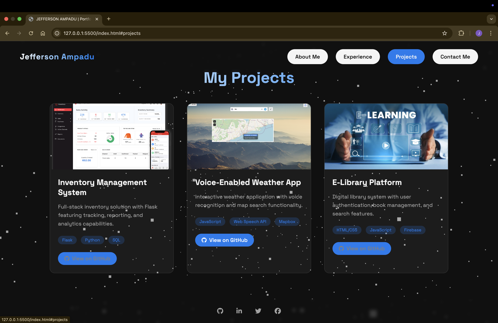
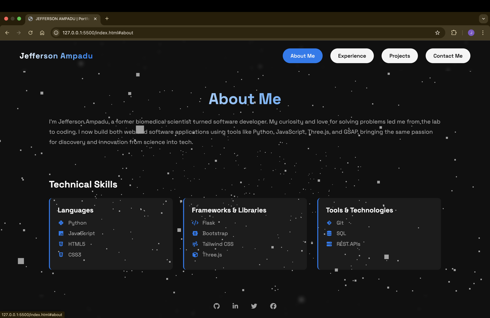
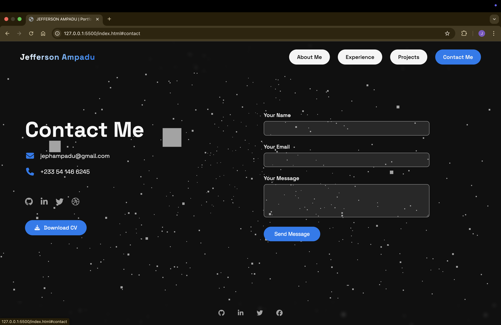

# 💼 Jefferson Ampadu — 3D Portfolio Website

This is my **personal 3D portfolio website**, crafted using **HTML**, **CSS**, and **JavaScript**, and enhanced with dynamic visuals using **Three.js**, **GSAP**, and **Typed.js**. It showcases my best work in a sleek, modern interface featuring smooth transitions and an interactive background inspired by **D3.js** effects.

---

## ✨ Features

- 🌐 **Fully responsive** design for all screen sizes
- 🎬 **Smooth animations** with [GSAP](https://greensock.com/gsap/)
- 🧠 Dynamic **D3-style background**
- 🎮 **Interactive 3D elements** powered by [Three.js](https://threejs.org/)
- ⌨️ **Typing animation** via [Typed.js](https://github.com/mattboldt/typed.js/)
- 📁 **Projects section** showcasing real-world work
- 📞 Contact and About sections for easy communication

---

## 🚀 Technologies Used

- **HTML5 & CSS3**
- **JavaScript (ES6+)**
- [**Three.js**](https://threejs.org/) – For rendering 3D scenes
- [**GSAP**](https://greensock.com/gsap/) – For smooth, timeline-based animations
- [**Typed.js**](https://github.com/mattboldt/typed.js/) – For simulating typed text
- [**D3.js**](https://d3js.org/) – Background effects (used for inspiration or integration)

---

## 📸 Previews

### 🧑‍💼 About

---

### 📁 Projects

---

### 📬 Contact Me

---

### 💼 Experience

